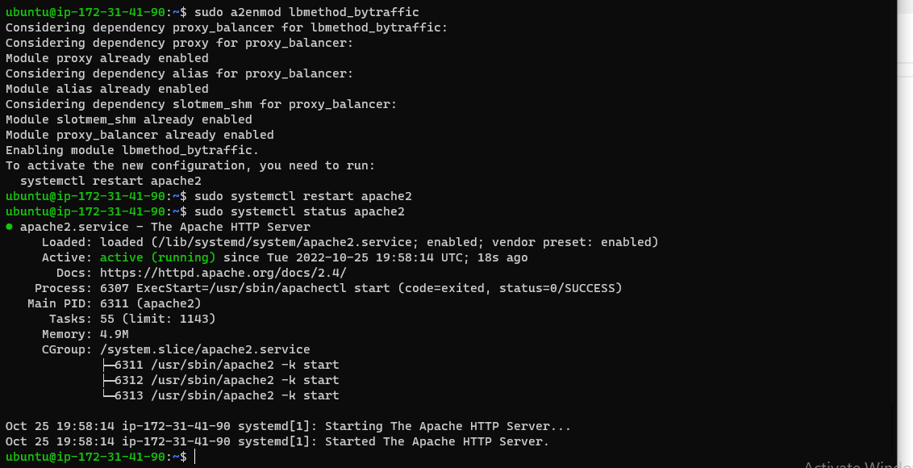
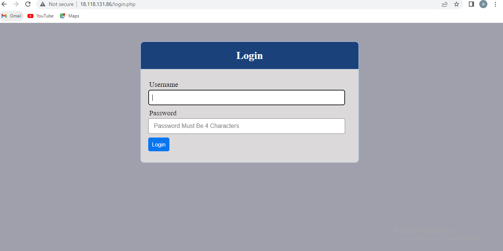
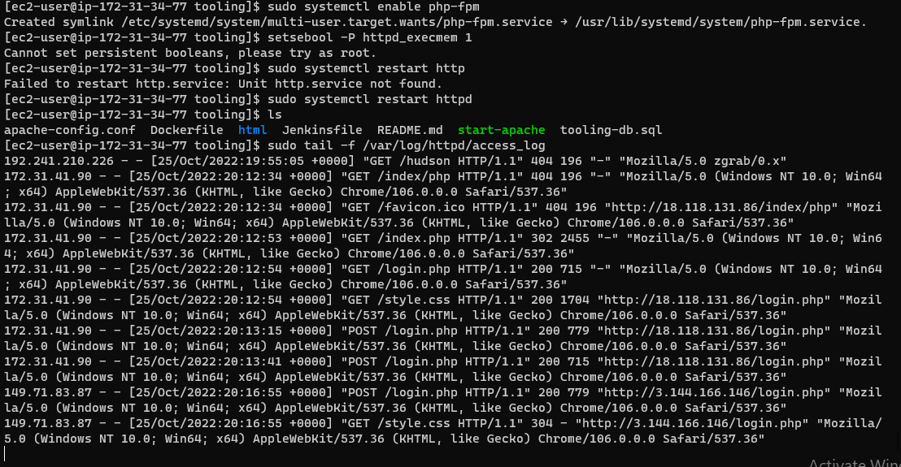

**CONFIGURE APACHE AS A LOAD BALANCER**

****

**Verify that my configuration works – Accessing my LB’s public IP address or Public DNS name from your browser**

****

**using the command below to see who access our server**

**sudo tail -f /var/log/httpd/access_log**

****

**curl your Web Servers from LB locally curl http://Web1 or curl http://Web2**

****

